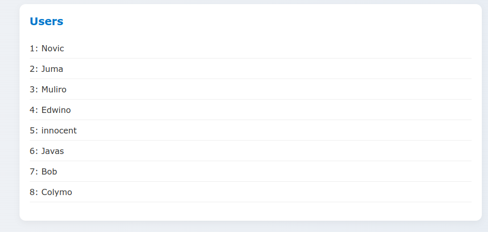
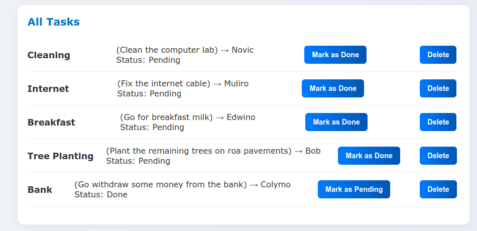
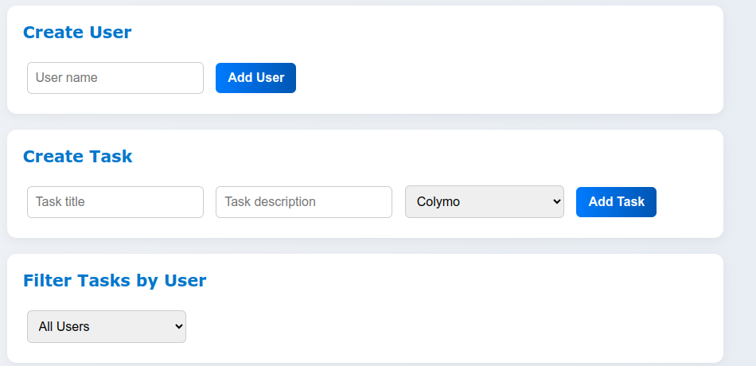

# 🗂️ Task Manager

A simple, browser-based Task Manager built with TypeScript and HTML. It allows you to:

- Create and manage users
- Assign tasks to users
- Toggle task completion status
- View all tasks or filter by user
- View pending tasks

---

## 🚀 Features

- ✅ Add & manage users
- 📝 Create and assign tasks
- 🔄 Toggle task status (Pending / Completed)
- 🔍 Filter tasks by assigned user
- 🧹 Clean and responsive UI with enhanced CSS styling

---

## 📸 UI Screenshots

### 🔹 All Users
<!-- Upload screenshot of user list -->

---

### 🔹 All Tasks (Assigned)
<!-- Upload screenshot of all tasks -->

---

### 🔹 Pending Tasks
<!-- Upload screenshot of pending tasks section -->

---

### 🔹 Assigning Tasks
<!-- Upload screenshot showing task creation and assignment -->

---

## 🛠️ Setup

1. Clone the repository
2. Run a development server (e.g., `parcel`, `vite`, or any local HTTP server)
3. Open `index.html` in your browser

Make sure your TypeScript compiles into JavaScript before running the app.

---

## 📁 Folder Structure

